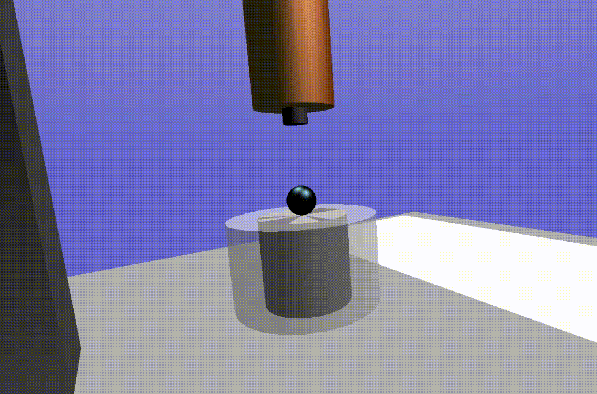
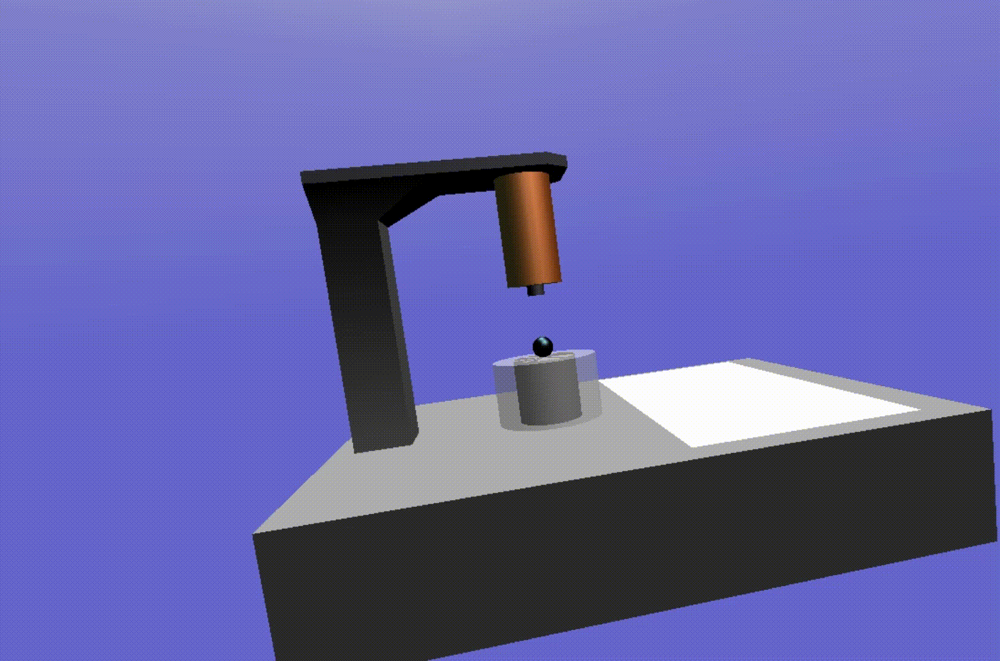

# Electromagnetic-Levitation-System-Modeling
<h2 align="center">Introduction </h2>
Magnetic levitation (maglev) or magnetic suspension is a method by which an object is suspended with no support other than magnetic fields. Magnetic force is used to counteract the effects of the gravitational force and any other forces.

The two primary issues involved in magnetic levitation are lifting forces: providing an upward force sufficient to counteract gravity, and stability: ensuring that the system does not spontaneously slide or flip into a configuration where the lift is neutralized.

Magnetic levitation is used for maglev trains, contactless melting, magnetic bearings, and for product display purposes.

[Wikipedia](https://en.wikipedia.org/wiki/Magnetic_levitation)

<h2 align="center"> Result </h2>

